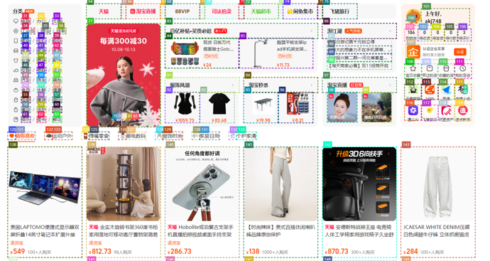
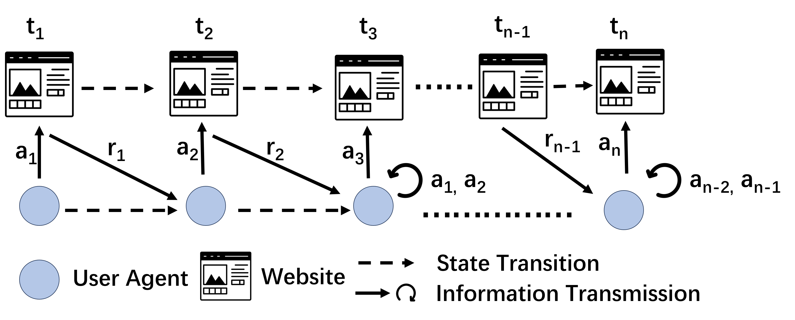

# UXRChain: Multi-Agent Framework for Fast Web User Experience Deficiencies Detection

<!-- 

    
    

 -->

    
    

User experience research (UXR) has always been an important part of web development. UXR includes a series of systematic methods (e.g., user interview, think aloud session and focus group discussion) to understand target users and their requirements as well as to introduce realistic contexts and insights to the design processes of final products. These methods have different advantages and play different roles in the entire UXR workflow. An example is that UXR teams often firstly collect the basic needs of potential users through large-scale questionnaires and then interview them to gain a deep understanding of their detailed expectations.

    
  

In this work, we designed a large language model driven multi-agent system UXRChain for efficient, sustainable, and low-cost web
user experience research. By simulating the real-world user experience research workflow, UXRChain can automatically and almost
cost-free complete a user experience study: i).Design appropriate research plans based on the provided UX questions, ii).Generate
simulated target users and organize them to test the studied web pages, iii).Execute the research plan on the
simulated users, and iv).Automatically analyze the data collected from users to provide final reports.
The overall pipeline of UXRChain comprises a study planning agent responsible for designing research plans addressing experience-related questions posed by developers, a variable number of user agents, a study execution agent to execute the study, and a data analysis agent to analyze the collected data and produce the final user exeprience report.

## What you need to do ?

1. Install the packages

2. Find the GPT API Endpoint and token places in utils/utils.py and input yours.

3. Change the task/task_test_json file to your website and user experience quesiton.

4. Remember to generate cookie file under Agent/ to login some pages.

4. Run the Agent/UXRAgent.py

5. Run the Agent/EndtoEnd_Analysis.py 

6. Wait for the user experiencce report !

## Acknowledgement

Our work is based on [webarea](https://github.com/MinorJerry/WebVoyager). The project is supported by [HexAI](https://www.hexai.tech/). 
