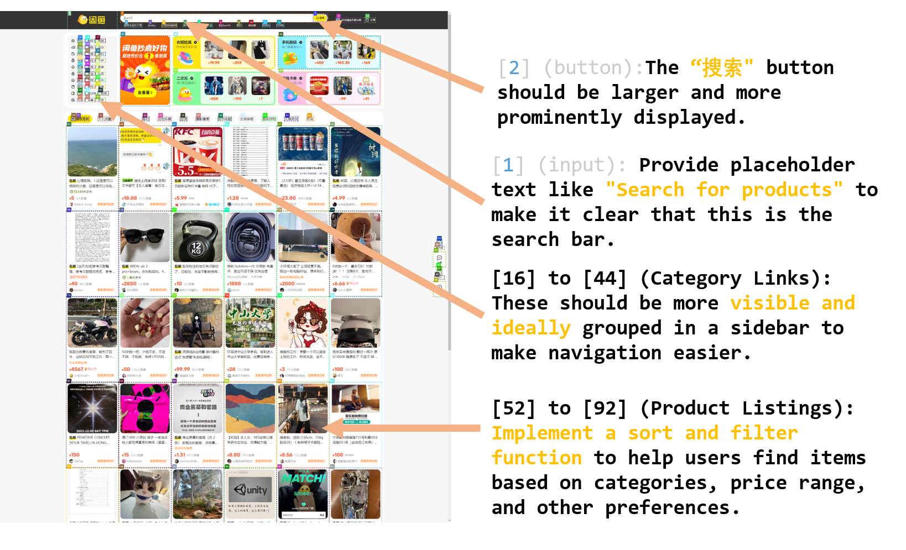
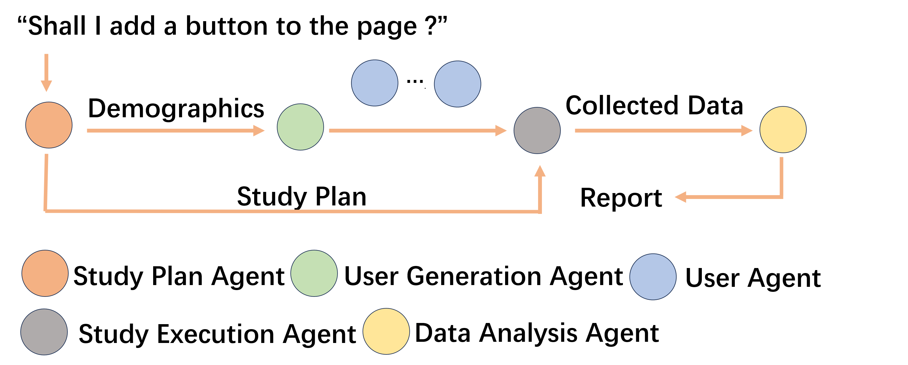

# UXRChain

## An Large Language Model Framework for Fast Web User Experience Deficiencies Detection

    

In this work, we designed a large language model driven multi-agent system UXRChain for efficient, sustainable, and low-cost web
user experience research. By simulating the real-world user experience research workflow, UXRChain can automatically and almost
cost-free complete a user experience study: i).Design appropriate research plans based on the provided UX questions, ii).Generate
simulated target users and organize them to test the studied web pages, iii).Execute and keep improving the research plan on the
simulated users, and iv).Automatically analyze the data collected from users to provide final reports.

    
 

The overall pipeline of UXRChain comprises a study planning agent responsible for designing research plans addressing experience-related questions posed by developers, a variable number of user agents, a study execution agent to execute the study, and a data analysis agent to analyze the collected data and produce the final user exeprience report.

## What you need to do ?

1. Install the packages

2. Find the GPT API Endpoint and token places in utils/utils.py and input yours.

2. Input your GPT API Endpoint and token in utils/utils.py

3. Change the task/task_test_json file to your website and user experience quesiton.

4. Run the Agent/UXRAgent.py 

5. Wait for the user experiencce report !

## Acknowledgement

Our work is based on [webarea](https://github.com/MinorJerry/WebVoyager).
